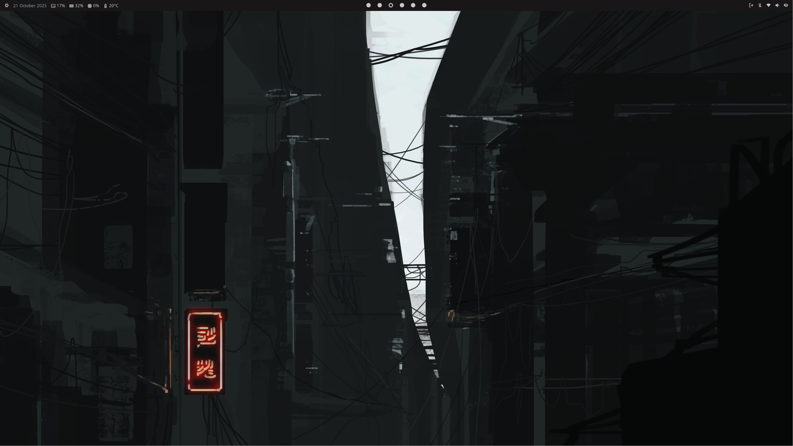

# NixOS Config

This is my personal NixOS configuration, featuring a Kanagawa Dragon themed
desktop environment.

## Inspiration and Attribution

This project is heavily derived from concepts and ideas found in
[nixos-config-reborn](https://github.com/Andrey0189/nixos-config-reborn) by
**@Andrey0189**. Their YouTube guides and repository were extremely helpful in
my own configuration.

As this configuration builds upon their foundational work, it is also licensed
under the **GNU General Public License v3.0 (GPL-3.0)**, in accordance with the
original project's licensing. You can find a copy of the license in the
`LICENSE` file within this repository.

## Features



- **Kanagawa Dragon Theme:** A consistent and eye-pleasing muted yet saturated
  theme
- **Hyprland + Waybar:** Minimal Hyprland setup with muted Kanagawa Dragon
  themed colors
- **Tmux + Neovim Setup (via NVF):** A powerful terminal multiplexer combined
  with a highly customized Neovim environment.
- **Fish + Starship:** A feature-rich shell with a cross-shell prompt.
- **Multiple Hosts:** Designed to be easily adaptable for various machines.
- **Home Manager Integration:** Seamless management of user-specific
  configurations.
- **Base 16 compliant:** Base 16 theme can easily be switched in the stylix
  module, just remember that the Neovim theme must be updated too.

## Installation

To get started with this NixOS setup, follow these steps:

1. **Install NixOS:** Refer to the official
   [NixOS Installation Guide](https://nixos.org/manual/nixos/stable/#sec-installation)
   for instructions on installing the base system.

2. **Clone this Repository:**

   ```bash
   git clone https://github.com/Marcus441/nixos-dotfiles.git ~/flake
   cd flake
   ```

3. **Prepare Your Host Configuration:** Navigate to the `hosts` directory and
   copy one of the existing host configurations as a starting point for your
   machine. Replace `<hostname>` with your desired machine's name.

   ```bash
   cd hosts
   cp -r UM790pro <hostname> # Example: cp -r UM790pro my-laptop
   cd <hostname>
   ```

4. **Copy `hardware-configuration.nix`:** Place your system's
   `hardware-configuration.nix` file into your newly created host directory.

   ```bash
   cp /etc/nixos/hardware-configuration.nix ./
   ```

5. **Customize Local Packages and System-wide Packages:** Edit the
   `local-packages.nix` file within your host directory and `nixos/packages.nix`
   in the parent directory to include your preferred software.

   ```bash
   nvim local-packages.nix
   nvim ../../nixos/packages.nix
   ```

6. **Update `flake.nix` for Your System:** Modify the `flake.nix` file at the
   root of the repository to reflect your specific `homeStateVersion`, `user`,
   and `<hostname>`.

   ```diff
   --- a/flake.nix
   +++ b/flake.nix
   @@
   -        homeStateVersion = "24.11"; # Update to your Home Manager version
   -        user = "marcus";            # Update to your username
   +        homeStateVersion = "<your_home_manager_state_version>";
   +        user = "<your_username>";
            hosts = [
   -            { hostname = "swift5"; stateVersion = "24.11"; }
   -            { hostname = "gpc"; stateVersion = "24.11"; }
   -            { hostname = "UM790pro"; stateVersion = "24.11"; }
   +            # Uncomment or add your hosts here
   +            { hostname = "<hostname>"; stateVersion = "<your_state_version>"; }
            ];
   ```

7. **Rebuild Your System:** After making the necessary changes, navigate back to
   the root of your cloned repository and rebuild your NixOS system.

   ```bash
   # Ensure you are in the root of cloned 'nixos-dotfiles' directory (now /home/<user>/flake) 
   # Example: cd ~/flake

   git add . # Stage your changes
   sudo nixos-rebuild switch --flake .#<hostname> # Use '.' for the current directory
   # OR: sudo nixos-install --flake .#<hostname> # for a fresh install 

   home-manager switch --flake .#<user>@<hostname> #eg alice@nixos
   ```

## Contributions

Contributions are welcome! Feel free to open pull requests or issues if you have
suggestions, improvements, or encounter problems. Please ensure any
contributions align with the project's GPL-3.0 license.
